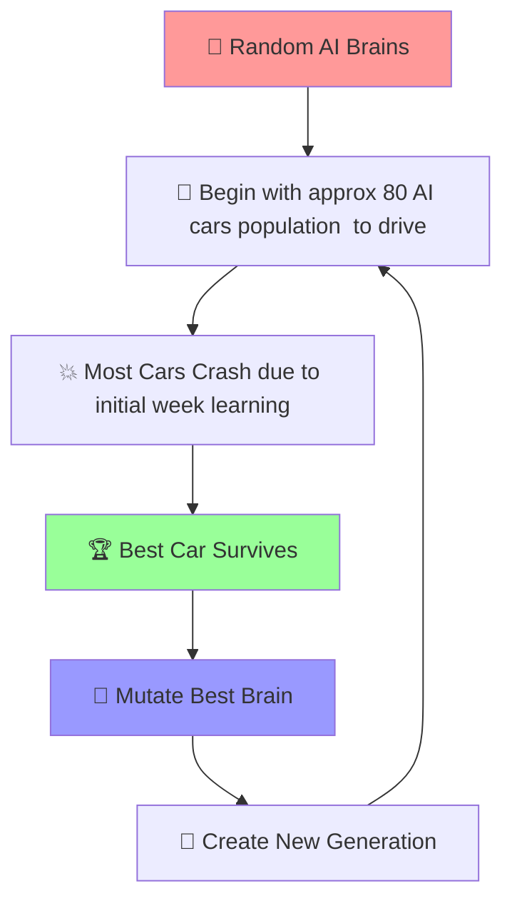

# AI Self Learning, Self Driving Car Simulation


[](https://opensource.org/licenses/MIT)
[](https://developer.mozilla.org/en-US/docs/Web/JavaScript)
[](https://en.wikipedia.org/wiki/Neural_network)
[](https://github.com/)

**🎯 A pure JavaScript neural network system that learns to drive cars autonomously and avoid obstacles**

[](https://postimg.cc/hJ8Cn8mD)


> 🙏 Inspired by [Dr. Radu Mariescu-Istodor ](https://radufromfinland.com/)
> FreeCodeCamp Dr Radu YT video (simple and easy version) [Self-Driving Car with JavaScript Course – Neural Networks and Machine Learning](https://www.youtube.com/watch?v=Rs_rAxEsAvI)
---

## *Live Demonstration (Use Simulation Now!)*
visit (Live URL) → [Live URL coming very soon]()

## Key Features

| AI Functions| Advanced Features|
|-------------|------------------|
| **Genetic Algorithm** with mutation-based evolution | **No external libraries** - Pure vanilla JavaScript|
| **Population-based** learning (80 AI cars per generation) | **Curved oval track** with dynamic traffic for mimicing real worl simulation
| **Fitness-driven** selection for optimal performance | Multi-layer perceptron|
| **Real-time** neural network visualization | **Collision avoidance** use sensor system to avoid damaged with traffic cars and road borders


## Quick Start (Running in your Device)

```bash
# Clone the repository
git clone https://github.com/Adya-Prasad/Self-Driving-Car-Simulation.git
cd <change to the application directory>

# Open in browser
open index.html
```


## 🎮 **Controls**

<div align="center">

| Button | Action | Description |
|--------|--------|-------------|
| **✔ Save** | `localStorage.setItem()` | Save the best AI brain for future sessions |
| **✘ Delete** | `localStorage.removeItem()` | Reset AI learning and start fresh |
| **❚❚ Pause** | *Coming Soon* | Pause/resume simulation (will implement in next version) |

</div>

### 🎯 **How to Use**
1. **🏁 Start**: Open the simulation and watch cars learn
2. **⏱️ Wait**: Let AI cars crash and learn (2-3 minutes)
3. **💾 Save**: When you see good performance, click "✔ Save"
4. **🔄 Refresh**: Reload page to see improved AI performance
5. **🔁 Repeat**: Keep saving better versions for continuous improvement

---

## 🧠 **How It Works**

### **🔄 The Learning Cycle**




## Neural Network Architecture

<div align="center">

```
    🔍 SENSORS (9)     🧠 HIDDEN LAYERS     🎮 OUTPUTS (4)
    
    Front Sensor  ──┐                      ┌── Forward
    Left Sensor   ──┤                      ├── Left Turn
    Right Sensor  ──┤   [16 Neurons]       ├── Right Turn  
    Peripheral    ──┤        ↓             └── Reverse
    Sensors (5)   ──┤   [10 Neurons]
                    ┤        ↓
    Speed Info    ──┤   tanh(Σ(w×i) + b)
    Angle Info    ──┘
```

</div>

### **🔬 Technical Details**

<details>
<summary><b>🧮 Network Specifications</b></summary>

- **Input Layer**: 11 neurons
  - 9 distance sensors (ray casting)
  - 1 normalized speed value
  - 1 normalized angle value
- **Hidden Layer 1**: 16 neurons (pattern recognition)
- **Hidden Layer 2**: 10 neurons (decision processing)  
- **Output Layer**: 4 neurons (driving controls)
- **Activation**: Hyperbolic tangent (tanh)
- **Learning**: Genetic algorithm with mutation

</details>

<details>
<summary><b>🎯 Sensor System</b></summary>

```javascript
// 9-ray sensor configuration
rayCount: 9              // Number of detection rays
rayLength: 180           // Detection distance (pixels)
raySpread: Math.PI * 0.75 // 135° field of view
```

**Ray Distribution:**
- **Center ray**: Straight ahead detection
- **Side rays**: Peripheral obstacle detection  
- **Wide spread**: 135° field of view for comprehensive awareness

</details>

---

## 📁 **Project Structure**

```
🚗 ai-self-driving-car/
├── 📄 index.html              # Main HTML structure
├── 🎨 style.css               # UI styling and layout
├── 🚗 car.js                  # Car physics and AI logic
├── 🧠 neural-network.js       # Neural network implementation
├── 🔍 sensor.js               # Ray-casting sensor system
├── 🛣️  road.js                # Track generation and rendering
├── 🎮 controls.js             # Input handling system
├── 📊 visualizer.js           # Neural network visualization
├── 🔧 utils.js                # Helper functions
├── 🎯 main.js                 # Core simulation loop
└── 📖 README.md               # This file
```

---

## 🎨 **Features Showcase**

### **🌈 Visual Neural Network**
- **Real-time visualization** of the best car's brain
- **Green connections**: Positive weights (excitatory)
- **Red connections**: Negative weights (inhibitory)
- **Animated data flow** showing decision-making process

### **🏁 Curved Track Design**
- **Oval racing circuit** with realistic physics
- **Dynamic traffic cars** as moving obstacles
- **Collision detection** with pixel-perfect accuracy
- **Responsive design** that adapts to screen size

### **📊 Advanced AI Features**
- **Temporal smoothing** reduces control flickering
- **Hysteresis** prevents rapid best-car switching
- **Graduated mutation** rates for stable evolution
- **Safety bonuses** reward collision avoidance

---

### 🔧 **Customization Guide**

#### **🎛️ Adjust AI Population**
```javascript
// In main.js - line ~26
cars = generateCars(80);  // Change number of AI cars
```


#### **🧠 Change Network Architecture**
```javascript
// In car.js - neural network creation
this.brain = new NeuralNetwork([11, 16, 10, 4]);
//                              ↑   ↑   ↑   ↑
//                           inputs hidden outputs
```

#### **🎯 Tune Mutation Rates**
```javascript
// In main.js - mutation section
const mutationRate = i < cars.length * 0.05 ? 0.02 :  // Elite: 2%
                   i < cars.length * 0.15 ? 0.08 :     // Good: 8%
                   i < cars.length * 0.4 ? 0.15 :      // Average: 15%
                   0.22;                                // Exploratory: 22%
```

---


## 🎓 **Educational Value**

### **🧠 Learn About:**
- **Neural Networks**: Forward propagation, backpropagation concepts
- **Genetic Algorithms**: Evolution-based optimization
- **Computer Vision**: Ray casting and collision detection
- **Game Physics**: 2D movement and rotation mathematics
- **JavaScript**: ES6+ features, Canvas API, Object-oriented programming

## 🚀 **Performance Optimization**

### **⚡ Optimization Features**
- **Efficient collision detection** with spatial optimization
- **Temporal smoothing** for stable control outputs
- **Graduated mutation rates** for faster convergence
- **Fitness-based selection** with hysteresis
- **Canvas optimization** with selective redraws

---

## 🤝 **Contributing**

I welcome contributions! Here's how you can help:

### **🐛 Bug Reports**
- Use GitHub Issues for bug reports
- Include browser version and steps to reproduce
- Screenshots/videos are helpful

### **✨ Feature Requests**
- **Simulation pause and resume** make button working
- **Multiple AI strategies** (aggressive vs defensive)
- **Additional road obstacles** like road pathhole, traffic light

### **🔧 Development Setup**
```bash
# Fork the repository
git clone https://github.com/yourusername/ai-self-driving-car.git

# Create feature branch
git checkout -b contri/feature-request

# Make changes and test
# Commit and push
git commit -m "Add amazing feature"
git push origin feature/amazing-feature

# Create Pull Request
```
## 📜 **License**

This project is licensed under the **MIT License** - see the [LICENSE](LICENSE) file for details.

```
MIT License - Feel free to use, modify, and distribute!
```

### 😎 **Acknowledgments**

#### *Enjoying the project? Give it a star🌟*

>Adya Prasad

**🚗💨 Happy AI Training! Watch your cars evolve from chaos to intelligence! 🧠✨**

*Made with ❤️ and lots of hard coded iteration 
